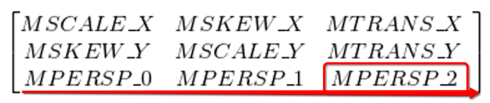
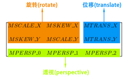
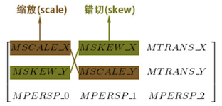
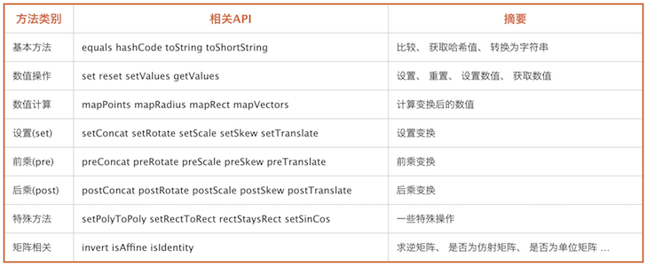
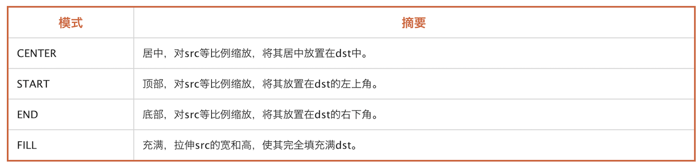
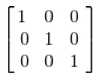

# 简介

`Matrix` 是一个矩阵，主要功能是坐标映射，数值转换。



要理解 `Matrix` 需要理解 `齐次坐标系`，
在 `Matrix` 中我们需要理解最后一排和最后一个参数的意义

# Matrix 变换

 <br/>


`Matrix` 变换 包含 `缩放(Scale)`，`错切(Skew)`，`旋转(Rotate)`，`平移(Translate)`
其中含包括 `前乘(pre)`，`后乘(post)`及`设置(set)`操作。

# Matrix API



这里需要重点理解的就是 `特殊方法` 了。

## setPolyToPoly

```java
boolean setPolyToPoly (
        float[] src,    // 原始数组 src [x,y]，存储内容为一组点
        int srcIndex,   // 原始数组开始位置
        float[] dst,    // 目标数组 dst [x,y]，存储内容为一组点
        int dstIndex,   // 目标数组开始位置
        int pointCount) // 测控点的数量 取值范围是: 0到4
```

> 与PS中自由变换中的扭曲有点类似

## setRectToRect

```java
boolean setRectToRect (RectF src,           // 源区域
                RectF dst,                  // 目标区域
                Matrix.ScaleToFit stf)      // 缩放适配模式
```

> 将 `源矩形RectF` 按照 `ScaleToFit`  填充到 `目标矩形RectF` 中
其中 `ScaleToFit` 是一个枚举



## rectStaysRect

> 判断矩形经过变换后是否仍为矩形, `mapRect` 方法的返回值就是根据 `rectStaysRect` 来判断的

## setSinCos

设置 `sinCos` 值，这个是控制 `rotate` 的，一般我们 使用 `Rotate` 方法即可。使用示例：

```java
// 方法一
void setSinCos (float sinValue,     // 旋转角度的sin值
                float cosValue)     // 旋转角度的cos值

// 方法二
void setSinCos (float sinValue,     // 旋转角度的sin值
                float cosValue,     // 旋转角度的cos值
                float px,           // 中心位置x坐标
                float py)           // 中心位置y坐标
```

# 矩阵相关

## invert ，求逆矩阵
## isAffine ，是否是仿射变换，恒为true
## isIdentity，是否为单位矩阵

> 如下即是一个单位矩阵




参考： [安卓自定义View进阶-Matrix详解](http://www.gcssloop.com/customview/Matrix_Method)
